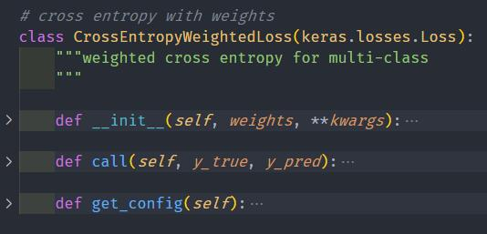

# Losses in Tensorflow

## losses implemented

**all losses inherit from kereas.losses.loss and obey official recommended practice of tensorflow 1 and 2.x**

- cross entropy with weights



- dice loss
- focal loss
- tversky loss
- lovasz-softmax loss

## requirments

tensorflow 1.15+ (also suitable for tensorflow 2.x)

Note: not supported by tensorflow 1.13 or older version since keras.losses.Loss is not defined.

## how to use?

- check an example for dice loss

```
logits_all_correct = [[4.0, 2.0, 1.0], [0.0, 5.0, 1.0], [4.0, 8.0, 3.0],[4.0, 8.0, 9.0]]
logits_all_wrong = [[2.0, 4.0, 1.0], [5.0, 2.0, 1.0], [8.0, 4.0, 3.0],[8.0, 2.0, 2.0]]
labels = [0, 1, 1, 2]

loss_fn = DiceLoss()
loss_fn(y_true=labels,y_pred=logits_all_correct),

print("Dice losses are {:.3f},{:.3f},{:.3f}".format(
    loss_name,
    loss_fn(y_true=labels,y_pred=logits_all_correct),
    loss_fn(labels,logits_all_wrong),
))
```

- other losses are similar, for more examples check `main.py`


- for training, just pass this loss to fit or relevant methods

```
import losses

# declare the model
loss_fn = losses.DiceLoss()
model.compile(loss=loss_fn, optimizer='adam')
...
```

## output test

```
ce losses are 0.045,1.272,0.507
wce losses are 0.043,0.855,0.219
dice losses are 0.119,0.955,0.265
focal losses are 0.003,1.793,0.749
tversky losses are 0.119,0.955,0.265
lovasz losses are 0.183,0.975,0.452
```


## refs
* [Keras Losses](https://keras.io/api/losses/)
* [kornia.losses — Kornia documentation](https://kornia.readthedocs.io/en/latest/losses.html)